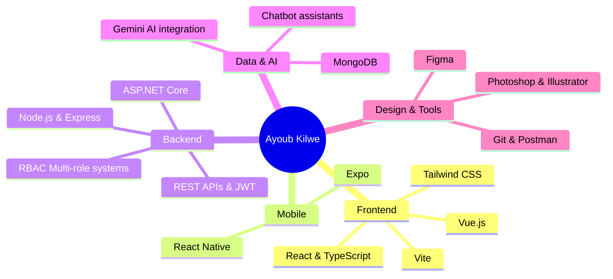
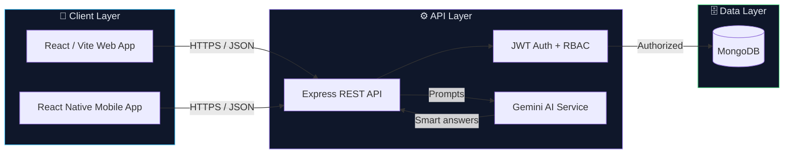
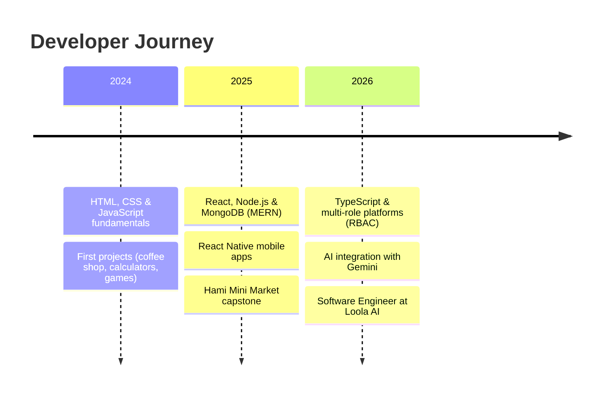

<!-- ===================== HEADER ===================== -->
<div align="center">


<a href="https://git.io/typing-svg">
  
</a>

<br/>

[](https://github.com/AyoubKilwe)
[](https://github.com/AyoubKilwe?tab=followers)
[](https://github.com/AyoubKilwe?tab=repositories)

</div>

<!-- ===================== ABOUT ===================== -->
## 🧑‍💻 About Me

```typescript
const ayoub = {
  name:      "Ayoub Jama Khalid",
  role:      "Full-Stack Software Engineer",
  company:   "Loola AI",
  location:  "Borama, Somaliland",
  stack:     ["TypeScript", "React", "Node.js", "Express", "MongoDB", "React Native"],
  focus:     ["AI-powered platforms", "Multi-role systems (RBAC)", "Mobile apps"],
  learning:  ["ASP.NET Core", "System design", "Cloud deployment"],
  contact:   "ayoubkilwe@gmail.com",
  motto:     "Solve real problems with clean, scalable code."
};
```

- 🚀 Building **AI-powered, multi-role platforms** for real markets (delivery, e-commerce, price comparison)
- 📱 Shipping **cross-platform mobile apps** with React Native
- 🧠 Integrating **LLMs (Gemini)** into production web apps
- 🌍 Passionate about technology that empowers **East Africa's local businesses**

---

<!-- ===================== TECH STACK ===================== -->
## 🛠️ Tech Stack

<div align="center">

### Frontend


### Mobile


### Backend


### Database & AI


### Tools


</div>

---

<!-- ===================== SKILLS MAP ===================== -->
## 🧭 Skills Map



---

<!-- ===================== HOW I BUILD ===================== -->
## 🏗️ How I Build Full-Stack Apps



---

<!-- ===================== FEATURED PROJECTS ===================== -->
## 🚀 Featured Projects

<table>
<tr>
<td width="50%" valign="top">

### 🍔 AI-Powered Food Delivery Platform
[](https://github.com/AyoubKilwe/Ai-Powered-multi-role-food-delivery-platform)


Multi-role food ordering ecosystem with **RBAC** and real-time dashboards for customers, restaurant managers, delivery drivers, and admins, plus an intelligent **AI chatbot assistant**.

</td>
<td width="50%" valign="top">

### 🛒 Market Price Comparison & Availability
[](https://github.com/AyoubKilwe/Market-Price-Comparison-and-Product-Availability-System-with-AI-Assistance)


MERN platform for **Hargeisa** markets: nearby shops, price alerts, market trends, vendor management and **Gemini AI** assistance.

</td>
</tr>
<tr>
<td width="50%" valign="top">

### 🏪 Smart Stationary
[](https://github.com/AyoubKilwe/Smart-Stationary)


Stationery e-commerce web app with a **React + Vite** frontend and an **ASP.NET Core (C#)** backend on MongoDB.

</td>
<td width="50%" valign="top">

### 🍽️ Restaurant App (React Native)
[](https://github.com/AyoubKilwe/Resturent-app)


Cross-platform restaurant ordering app built with **React Native**. Also see [Image Generator](https://github.com/AyoubKilwe/Image-generator) (Pexels API + Node.js) and [Hami Mini Market](https://github.com/AyoubKilwe/Hami-Mini-Market-full-project-requirments) (cart & checkout capstone).

</td>
</tr>
</table>

---

<!-- ===================== JOURNEY ===================== -->
## 🗺️ My Journey



---

<!-- ===================== GITHUB STATS ===================== -->
## 📊 GitHub Analytics

<div align="center">


<br/><br/>


<br/><br/>


<br/><br/>


</div>

---

<!-- ===================== CONNECT ===================== -->
## 🤝 Let's Connect

<div align="center">

[](mailto:ayoubkilwe@gmail.com)
[](https://github.com/AyoubKilwe)
[](https://www.linkedin.com/in/ayoub-kilwe-51b40a390)

<br/>

> *"Solve real problems with clean, scalable code."*


</div>
