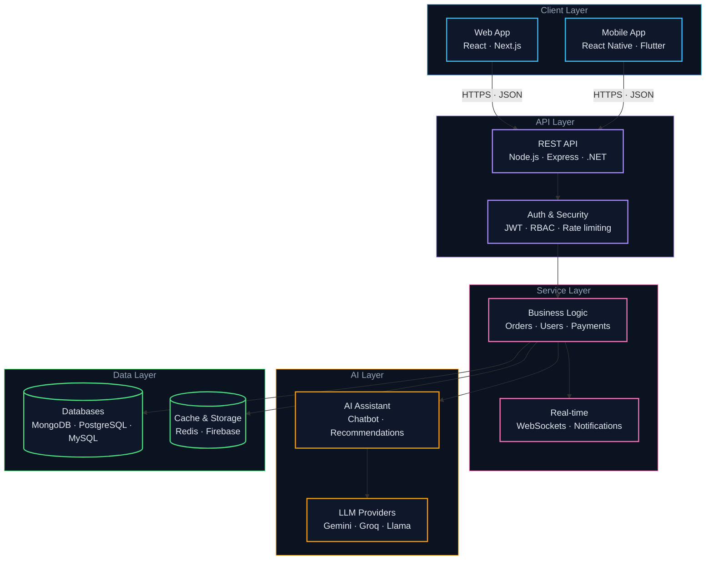

<div align="center">


<a href="https://git.io/typing-svg"></a>

<br/>

[](https://ayoubkilwe.dev)
[](mailto:ayoubkilwe@gmail.com)
[](https://www.linkedin.com/in/ayoub-kilwe-51b40a390)
[](https://github.com/AyoubKilwe)
[](https://github.com/AyoubKilwe?tab=followers)

</div>

<br/>

## 👨‍💻 About Me

🌐 **Portfolio:** [ayoubkilwe.dev](https://ayoubkilwe.dev)

```typescript
const ayoub = {
  role:       "Software Engineer",
  location:   "Borama, Somaliland",
  languages:  ["JavaScript", "TypeScript", "Python", "Dart", "SQL"],
  databases:  ["MongoDB", "MySQL", "PostgreSQL", "SQL Server", "Firebase"],
  frameworks: ["Next.js", "React", "React Native", "Flutter", "Node.js", ".NET"],
  builds:     ["Web platforms", "Mobile apps", "REST APIs", "AI-powered systems"],
  mindset:    "Language-agnostic. Pick the right tool, ship the right product."
};
```

<br/>

## 🛠️ Tech Stack

<div align="center">

**Languages**<br/>


**Frameworks & Runtime**<br/>


**Mobile**<br/>


**Databases**<br/>


**Tools**<br/>


</div>

<br/>

## 🏗️ Architecture I Build



<br/>

## 🚀 Featured Projects

| Project | Description | Stack |
|:--|:--|:--|
| [**AI Food Delivery Platform**](https://github.com/AyoubKilwe/Ai-Powered-multi-role-food-delivery-platform) | Multi-role delivery ecosystem with RBAC, real-time dashboards and an AI chatbot assistant | `TypeScript` `React` `Node.js` |
| [**Market Price Comparison**](https://github.com/AyoubKilwe/Market-Price-Comparison-and-Product-Availability-System-with-AI-Assistance) | Price comparison & product availability platform with price alerts and Gemini AI | `MERN` `Gemini AI` |
| [**Smart Stationary**](https://github.com/AyoubKilwe/Smart-Stationary) | E-commerce web app with React frontend and ASP.NET Core backend | `React` `C#` `MongoDB` |
| [**Restaurant App**](https://github.com/AyoubKilwe/Resturent-app) | Cross-platform restaurant ordering mobile app | `React Native` |

<br/>

## 📊 GitHub Stats

<div align="center">


<br/><br/>


<br/><br/>


</div>

<br/>

<div align="center">


</div>
