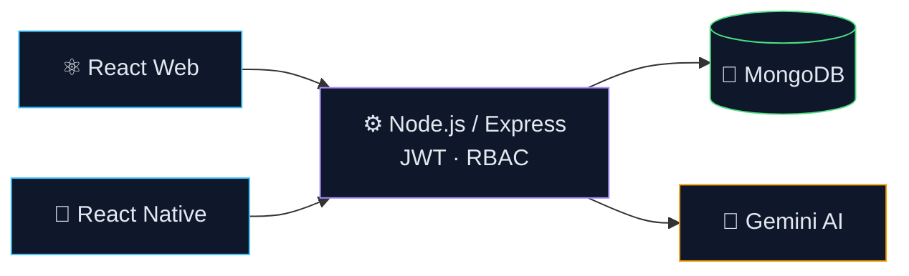

<div align="center">


<a href="https://git.io/typing-svg"></a>

<br/>

[](mailto:ayoubkilwe@gmail.com)
[](https://www.linkedin.com/in/ayoub-kilwe-51b40a390)
[](https://github.com/AyoubKilwe)
[](https://github.com/AyoubKilwe)

</div>

<br/>

## 👨‍💻 About Me

```typescript
const ayoub = {
  role:     "Full-Stack Software Engineer",
  location: "Borama, Somaliland",
  stack:    ["TypeScript", "React", "Node.js", "MongoDB", "React Native"],
  focus:    ["AI-powered platforms", "Multi-role systems", "Mobile apps"],
  motto:    "Solve real problems with clean, scalable code."
};
```

<br/>

## 🛠️ Tech Stack

<div align="center">


<br/>


</div>

<br/>

## 🏗️ Architecture I Build



<br/>

## 🚀 Featured Projects

| Project | Description | Stack |
|:--|:--|:--|
| [**AI Food Delivery Platform**](https://github.com/AyoubKilwe/Ai-Powered-multi-role-food-delivery-platform) | Multi-role delivery ecosystem with RBAC, real-time dashboards and an AI chatbot assistant | `TypeScript` `React` `Node.js` |
| [**Market Price Comparison**](https://github.com/AyoubKilwe/Market-Price-Comparison-and-Product-Availability-System-with-AI-Assistance) | Price comparison & product availability platform with price alerts and Gemini AI | `MERN` `Gemini AI` |
| [**Smart Stationary**](https://github.com/AyoubKilwe/Smart-Stationary) | E-commerce web app with React frontend and ASP.NET Core backend | `React` `C#` `MongoDB` |
| [**Restaurant App**](https://github.com/AyoubKilwe/Resturent-app) | Cross-platform restaurant ordering mobile app | `React Native` |

<br/>

## 📊 GitHub Stats

<div align="center">


<br/><br/>


<br/><br/>


</div>

<br/>

<div align="center">


</div>
